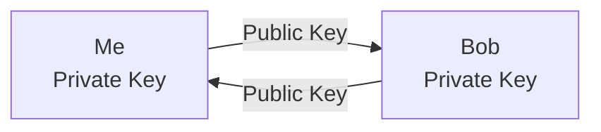

Suppose we have come information that we want to share with a friend, Bob in this case, on the internet. Now as we all know, the internet is full of unsavory characters, lets call them Eve, so we cant trust that what we send to Bob will not be intercepted by the evil doer's. This is a common scenario where we use [Asymmetric Encryption Algorithms](terms#asymetric), and the most well known one is RSA.

The letters, RSA, come from the first letters of the authors (Ron Rivest, Adi Shamir, and Leonard Adleman) of the paper that described the algorithm in 1973. The brilliant part is that they figured out, after a night of drinking no less the story goes, that because there is no better way to do prime factoring than trying each number in turn, it can be used as a "one way trapdoor". In maths a trapdoor is a function that is easy to calculate one way, but very difficult to reverse. For example if I told you that 901 is the factor of 2 prime numbers, could you come up with those two numbers? But if I told you that one of the numbers is 17 you can easily calculate that $$ 901 / 17 = 53 $$ . RSA uses this concept but with very big prime numbers.

{.img-thumbnail .float-right .ml-3 .text-center style="width: 350px"}
:::

:::
First of all a high level explication on how RSA works:
1. We generated a public key and a private key.
2. We send the _public_ key to Bob.
2. Bob generates his own public and private keys.
2. Bob sends us his _public_ key.
2. Now that we have Bob's public key we can use that to encrypt any messages we want to send to Bob.
2. Bob can use our public key to send messages to us.

Some things to note:
* The _private_ key is never sent over the untrusted network.
* Once Bob encrypts the message with our public key, there is no way for him to decrypt it. This means that Eve can't decrypt it ether.

Alright, lets break it down a bit further and just focus on one leg of the conversation because the otherside is the same in reverse.
1. Suppose the message that we want to send to Bob is the number 42. $$ (P = 42) $$ 
2. Bob generates his public key $$ (n = 17, e = 7) $$ .
2. Bob also generates his private key $$ (j = 53) $$ .
2. Bob sends us his public key $$ (n = 901, e = 7) $$ .
2. We use the public key to encrypt the message $$ (P = 42) $$  into the an encrypted message $$ (E = 30) $$ .
2. We send the encrypted message $$ (E = 30) $$  to Bob.
2. Bob uses his private key $$ (j = 53) $$  to convert the message back to 42.

Lets work through the maths of the example and show how the mystery $$ e $$  was calculated.

## Generating Public and Private keys
Calculating the public key is done as follows:

| Algorithm                                                | Example                                                                                                                                                                            |
|----------------------------------------------------------|------------------------------------------------------------------------------------------------------------------------------------------------------------------------------------|
| 12                                                       | Pick two prime numbers. In this example we picked $$ n = 17 $$  and $$ q = 53 $$ .                                                                                                           |
| $$ n = pq $$                                             | $$ n = 17 * 53 = 901 $$                                                                                                                                                              |
| $$ z = (p - 1)(q - 1) $$                                 | $$ z = (17 - 1)(53 - 1) = 832 $$                                                                                                                                                     |
| Select $$ e, 1 < e < z $$  such that: $$ gcd(e, z) = 1 $$        | Pick a prime number $$ e $$  that is greater then 1 and less than 832 and where $$ z $$  is not divisible by $$ e $$ . In this example lets choose 7. $$ e=7 $$                                     |
| Select $$ d, 1 < d < z $$  Such that: $$ ed \equiv 1 \pmod z $$  | Find a number $$ d $$  that when multiplied by 7 and then devided by 832, the remander is 1. $$ (7)(d)\mod 832 = 1 $$ Let's choose 119. $$ (7)(119) = 833 $$ $$ 833 \mod 7 = 1 $$ $$ d = 119 $$ |

The public key is the combination of $$ n = 17 $$  and $$ e = 7 $$  and the Private is the combination of $$ n = 17 $$  and $$ d = 119 $$ 

## Encrypting Data
Bob sends us his public key and we use that to encrypt our message $$ M $$ , the number 42, to create the encrypted message $$ C $$ .

| Algorithm          | Example  |
|--------------------|----------|
| $$C = M^e \mod n$$ | We calculate 42 to to the power of 7 and the remainder of that number divided by 901 is the encrypted message. $$C = 42^7 \mod 901$$ $$C = 134$$ |

## Decrypting Data
We send the encrypted message $$ C $$  to Bob. He uses his private key to decrypt the message.

| Algorithm           | Example  |
|---------------------|----------|
| $$M' = C^d \mod n$$ | Bob calculates 134 to the power of 119 and the remainder of that number divided by 901 is the message. $$M' = 134^{119} \mod 901$$ $$M' = 42$$ |

As you can see Bob has managed to decrypt the our message.

This example used very small prime numbers. In practice these numbers are _much_ bigger.